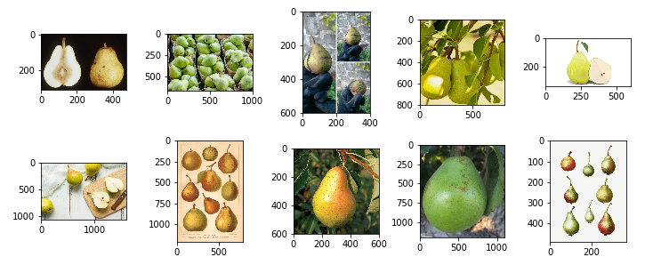
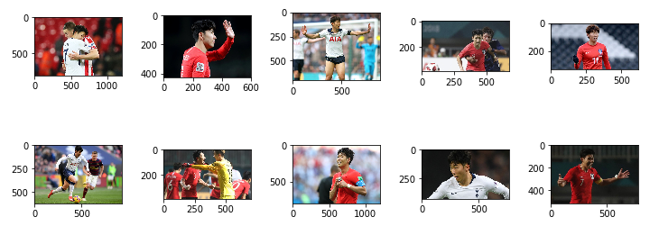

<<<<<<< HEAD
<h1 align=center> Pearson – image classification using CNN</h1>

## General info
The project is an attempt to image classification using Convolutional Neural Network with Keras and self-prepared Pearson image dataset. 

## Content
`script.js` - few lines of code which allows to scrap URLs of images already loaded in Google Images page 

`pears_urls.txt` / `sons_urls.txt`- text files of pears/Sons images URLs, generated using script.js code

`download-images.py` - download images from URLs sourced in above .txt files

`images.zip` - pack of downloaded and preselected images, the dataset is devided into training and validation sets

`pearson.ipynb` - contains data preparation, sequential model (keras), it's training and simple evaluation

`requirements.txt` - list of Python dependencies of the project, e.g. **numpy, pandas, tensorflow, keras** (including **jupyter notebook** packages)

## Summary
The main goal of this project is to apply simple CNN model for image classification using technology provided by keras. I'm not fully sattisfied of the evaluation of that project but on the other hand I kept in mind issues connected with applied assumptions. I will point out the 4 main conclusions:

**1. Too small data set** - whole data set after preselection counted 1108 images, of wchich 400 pears 
images and 508 Sons images in training set. Validation set was 20% of dataset.

**2. The applied model architecture wasn't perfect** - my simple model counted only 12 layers. For example **ResNet50** model (from ImageNet competition) included about 150 layers, with over 25 000 000 of params, but it was trained on over 1.2 mln images. In my opinion there is no sense for creating more complicated model to such a tiny dataset, due to overfitting probabillity. It is much easier to overfit model with less amount of data. However, it is possible to make some changes, that will not complicate the model much and could increase accuracy. I must admit that I still improve my skills in deep learning and generally speaking in data science and IT. Every day I'm learning new practical skills, even while working on that project.

**3. Other objects appearance** - I need to point out about one more important issue. Other objects that appears on the images have impact on the final result. For example, Son is usually surrounded by grass (of football pitch). If we will try to predict category of a pear lying on the grass it is more likely that pear is actually Son. And one of factors that will cause that situation is grass on the image. Additionally Son has red T-shirt on many pictures. That's why it is even more likely that red pear on the grass is Spurs player!
<h4 align=center>Sample of Pears</h4>



<h4 align=center>Sample of Sons</h4>


**4. Not rotated images** - the model should work in the same way regardless of rotation of images. In presented model rotated image provides different results. 

## How to use

To clone and run the project, you'll need Git (including [git large file storage](https://github.com/git-lfs/git-lfs/wiki/Installation "Guide to install Git Large File Storage") to download the images.zip archive.) and Python 3 installed. I'm gonna show you how to prepare the environment before working. The easiest way is to use pip and Python virtual environment (**virtualenv package**), but actually it's more convenient to use **conda** instead due to **[performance](https://towardsdatascience.com/stop-installing-tensorflow-using-pip-for-performance-sake-5854f9d9eb0c)**.

### Windows

Firstly you need to download and install [git-lfs](https://github.com/git-lfs/git-lfs/releases/download/v2.7.2/git-lfs-windows-v2.7.2.exe). Then from your command line:

```bash
# install git-lft
$ git lfs install
# here should occur an information like: 'Git LFS initialized'.

# install python virtual environment
$ pip install virtualenv

# Clone this repository
$ git clone https://github.com/ThePearsSon/pear-sons.git

# Go into the repository
$ cd pear-sons

# Create and activate virtual environment
$ python -m venv env
$ env\Scripts\activate.bat

# Install dependencies
$ pip install -r dependencies.txt

# Launch jupyter notebook and have fun
$ jupyter notebook

```

### Linux

Firstly you need to download and install git-lfs. To do that you will need root access. Then from your command prompt:

```bash
$ curl -s https://packagecloud.io/install/repositories/github/git-lfs/script.deb.sh | sudo bash
$ sudo apt-get install git-lfs
$ git lfs install
# here should occur an information like: 'Git LFS initialized'.

# install python virtual environment
$ pip install virtualenv

# Clone this repository
$ git clone https://github.com/ThePearsSon/pear-sons.git

# Go into the repository
$ cd pear-sons

# Create and activate virtual environment
$ python -m venv env
$ source env/bin/activate

# Install dependencies
$ pip install -r dependencies.txt

# Launch jupyter notebook and have fun
$ jupyter notebook
```

=======
# pear-sons
Simple image classification using CNN (Keras) and 'PearSon' dataset.
# introduction
The project was aimed to conduct a simple image classification using convolutional neural network.

 
>>>>>>> 8c776d6b6087d0f90ef329fdab561489b7796d3d
